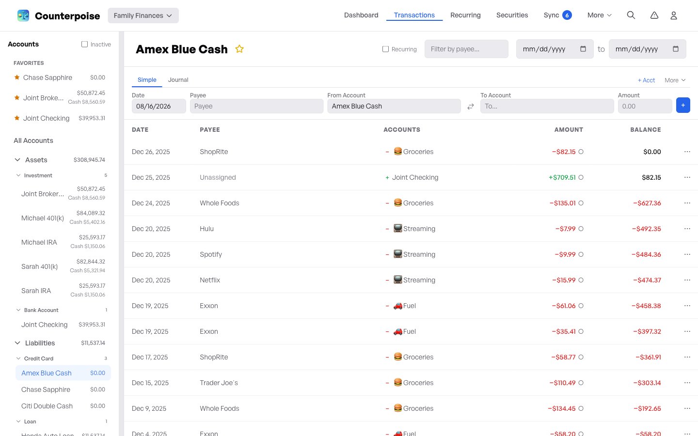
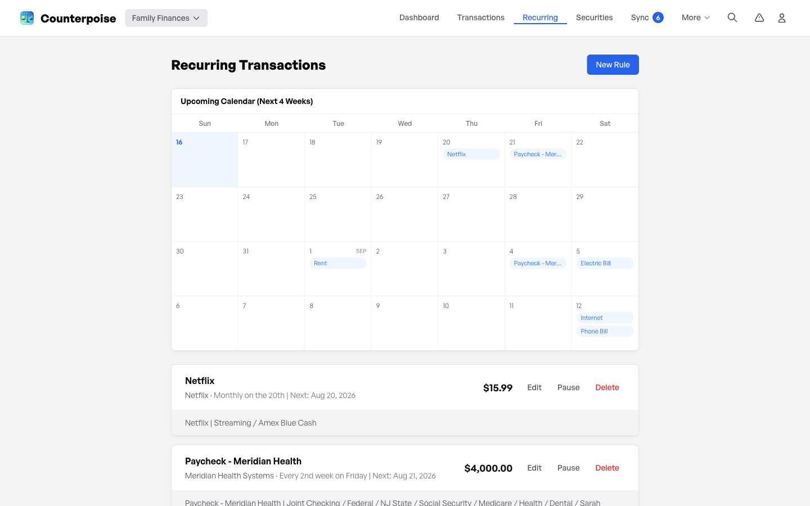
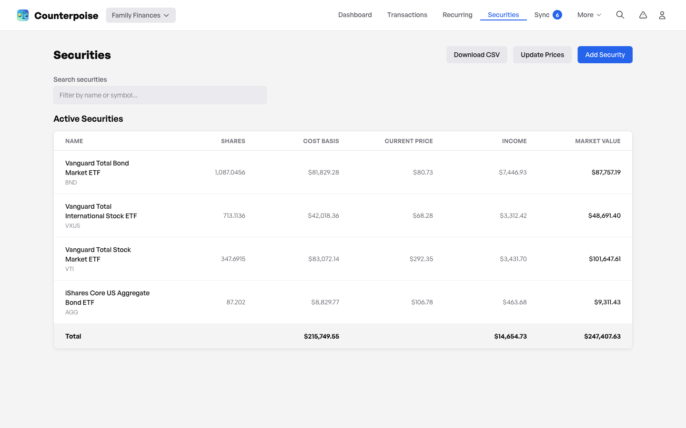
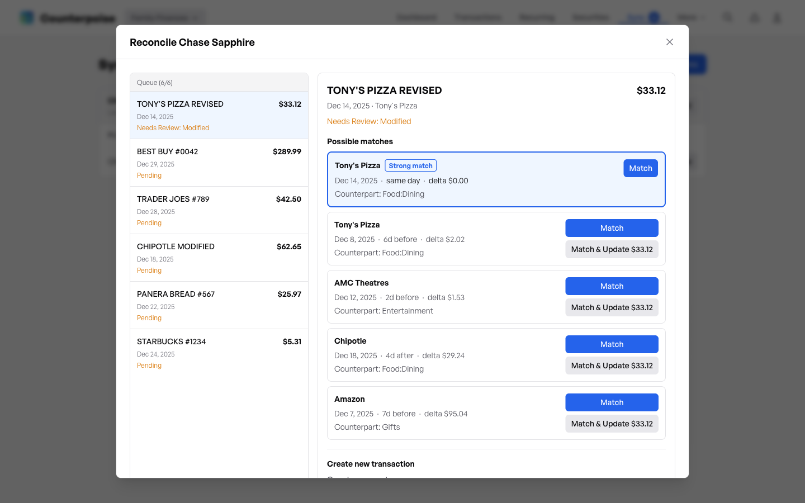

# Counterpoise - Personal Finance Accounting

A web-based double-entry accounting application for personal finance management, built with modern technologies and accounting best practices. Supports multiple books per user, investment tracking, and bank sync via Plaid.

## Screenshots

Every screenshot below is the sample data you get from **Add demo book** — no setup, and nothing real in it.

| | |
| :-- | :-- |
| **Transactions** | **Recurring** |
| [](images/screenshot-transactions.png) | [](images/screenshot-recurring.png) |
| Per-account register with a running balance, category icons, and inline entry. | An upcoming calendar over the rules behind it, including a multi-split paycheck. |
| **Securities** | **Bank sync** |
| [](images/screenshot-securities.png) | [](images/screenshot-sync.png) |
| Holdings with FIFO cost basis, income, and market value. | Plaid items matched against the ledger, with strong-match detection. |

## Features

### Core Accounting
- **True Double-Entry Bookkeeping** - Every transaction has balanced debits and credits
- **Chart of Accounts** - Five account types: Assets, Liabilities, Equity, Income, Expenses
- **Account Subtypes** - Bank, Credit Card, Loan, Investment, Cash accounts
- **Split Transactions** - Support for complex transactions involving multiple accounts (e.g., paychecks)
- **Running Balance** - Real-time balance calculation per account
- **Account Hierarchy** - Organize accounts with parent-child relationships

### Multi-Book Support
- **Multiple Books** - Maintain separate sets of books (e.g., personal, business)
- **Demo Book** - One click fills a brand-new book with a sample dataset (a household of three years or a single homeowner of two years, ending today): transactions, investment lots with cost basis, recurring rules, and a bank-sync queue waiting to be reconciled
- **User Authentication** - Session-based auth with scrypt password hashing
- **Registration Control** - Signup open, closed, or self-closing after the first account, via `REGISTRATION_ENABLED`
- **Book Isolation** - Data isolated by bookId within a single database

### Transaction Management
- **Simple Mode** - Quick entry for two-account transfers
- **Journal Entry Mode** - Full debit/credit ledger for advanced transactions
- **Transaction History** - View all transactions with filtering by account
- **Future Transaction Highlighting** - Scheduled transactions shown with visual indicator
- **Edit & Delete** - Full transaction modification capabilities
- **Floating Transactions** - Entries whose effective date auto-advances to today until reconciled

### Investment Tracking
- **Securities Management** - Track stocks, ETFs, and mutual funds
- **Buy/Sell/Dividend** - Full investment transaction support
- **FIFO Lot Tracking** - Automatic cost basis calculation
- **Position Summaries** - View holdings with market values
- **Price History** - Historical price data with Tiingo integration
- **Automatic Price Sync** - End-of-day prices fetched from Tiingo after each market day via cron
- **Quick Price Entry** - Banner prompts for marks on manually-priced securities (e.g., options)

### Recurring Transactions
- **Automated Rules** - Set up recurring income and expenses
- **Multiple Frequencies** - Daily, weekly, monthly, yearly, with custom intervals (e.g., every 2 weeks)
- **Next Date Tracking** - Automatically calculates next occurrence
- **Early Auto-Create Window** - Auto-create X days before the scheduled date (per rule)
- **Cron Processing** - Hourly automatic processing by the server

### Bank Sync (Plaid)
- **Bank Connection** - Connect bank accounts via Plaid
- **Transaction Import** - Import transactions from connected accounts
- **Reconciliation** - Match imported transactions with existing records
- **Auto-Matching** - Learned payee-based matching runs automatically after each sync

### Financial Reporting
- **Dashboard** - Net worth, assets, liabilities, income, expenses
- **Balance Sheet** - Real-time snapshot of financial position
- **Income Statement** - Track income vs. expenses
- **Account Balances** - Automatic calculation with proper accounting signs
- **CSV Export** - Download report and security data as CSV

### AI Integration (MCP)
- **MCP Server** - Read/write access to accounting data for AI assistants, over stdio or HTTP (see [guides/mcp-server.md](guides/mcp-server.md))
- **API Keys** - Per-user `cpk_` keys managed on the Account page, scrypt-hashed at rest
- **Usage Analytics** - Optional PostHog integration for usage events. Custom events carry no financial values, but `$pageview` sends the full URL including its query string, and the search page puts the typed query in `?q=` — see [guides/posthog-analytics.md](guides/posthog-analytics.md)

### User Experience
- **Clean Modern UI** - Built with Tailwind CSS for a polished interface
- **Responsive Design** - Works on desktop and mobile devices
- **Sidebar Navigation** - Quick access to account filters
- **Autocomplete Search** - Type-ahead account and payee selection
- **Active/Inactive Accounts** - Hide accounts you're not using
- **Keyboard Shortcuts** - Global shortcuts with a `?` help overlay
- **In-App Issue Reporting** - Report bugs and improvement ideas from any page

## Tech Stack

- **Web client**: React with React Router, built by Vite into static files
- **API server**: Rust (Axum and SQLx). It serves the API, the MCP server and the client build, and runs the scheduled jobs and the backups
- **Language**: TypeScript in the browser, Rust on the server. The browser runs the shared Rust domain code as WASM
- **Styling**: Tailwind CSS
- **Database**: SQLite, one file
- **Schema and migrations**: numbered SQL files in `rust-api/db/migrations/`, applied by the server when it starts
- **Testing**: Vitest (unit), `cargo test`, Playwright (E2E)

## Prerequisites

- Node.js 26+
- npm
- Rust with `cargo` and the `wasm32-unknown-unknown` target. `npm run dev`
  builds the core crate to WASM, and the server and `npm run db:seed` are Rust
- Docker, for a production deployment only. Development needs no Docker

## Installation

1. Clone the repository:
```bash
git clone https://github.com/jeffjjohnston/counterpoise-ledger.git
cd counterpoise-ledger
```

2. Install dependencies:
```bash
npm install
```

3. Seed with sample data (optional):
```bash
npm run db:seed
```

This deletes and recreates the development database, `data/counterpoise.db`,
creates a sample `admin` user with password `password`, creates a sample book,
and seeds it with data. The dates end today. Add `-- --today YYYY-MM-DD` to
pin the end date (`2025-12-31` gives the 2023-2025 rows, 2,235 transactions).
Add `-- --dataset single` for the single-homeowner dataset. The default is
`household`. If you want to seed an existing book instead, first
create the book, then run `npm run db:list-books` to find its ID and
`npm run db:seed -- --book-id <id>`. The seed runs `ledger-cli seed` through
`cargo run`, so the first run also builds the Rust CLI. Stop the API server
first: the seed refuses while a server uses the file.

If you skip seeding, the API server creates the database and applies the
migrations when it first starts.

4. Start the API server and the Vite development server, in two terminals.
   Vite serves the client on port 3000. It sends every `/api` request to the
   API server on `127.0.0.1:4000` (set `RUST_API_URL` to use a different address):
```bash
cargo run --manifest-path rust-api/Cargo.toml -p counterpoise-rust-api
npm run dev
```

Set `DATABASE_PATH` to use a database file other than `data/counterpoise.db`.

5. Open [http://localhost:3000](http://localhost:3000).

If you ran `npm run db:seed`, sign in with `admin` / `password`. Otherwise, register an account and create a book.

To explore with realistic data instead of an empty book, click **Add demo book**
on the books page. It creates a book named "Demo Book" (or "Demo Book - Single")
and fills it with the same sample dataset the seed uses. The books page shows one row
for each dataset: `household` or `single`. The API is `POST /api/books/demo` with an
optional `{ "dataset": "household" | "single" }`, and `GET /api/books/demo/datasets`
lists the datasets. Unlike `npm run db:seed`, which resets the
entire database, this only ever writes to the book it just created — so it is
safe to run on an instance that already holds real data, and you can add several.
It writes thousands of rows in one transaction, so give it a few seconds. If it
fails, no demo book remains.

The development checkout is separate from production. For a Docker deployment,
use a separate production clone (`~/counterpoise-production` by default, branch
`main`). See "Docker Deployment" below.

## Database Architecture

Counterpoise keeps all data in one SQLite file: the meta tables (users,
sessions, books) and the book-scoped tables. Book-scoped tables have a
`book_id` foreign key for data isolation. `DATABASE_PATH` names the file. The
default is `data/counterpoise.db` in development and `/data/counterpoise.db`
in the Docker image. The server applies the migrations when it starts. See
[guides/database-management.md](guides/database-management.md).

### Core Tables

- **accounts** - Chart of accounts with hierarchy (types: asset, liability, equity, income, expense)
- **transactions** / **transaction_splits** - Double-entry transactions
- **securities** / **security_prices** - Investment securities and price history
- **investment_splits** / **investment_lots** - Investment transactions and FIFO lot tracking
- **payees** - Deduplicated payees (normalized-name matching)
- **recurring_rules** / **recurring_template_splits** - Recurring transaction templates
- **plaid_tokens** / **plaid_accounts** / **plaid_transaction_reconciliation** - Bank sync via Plaid
- **api_keys** - User API keys for MCP access
- **issue_reports** - In-app issue reports (meta table, scoped to user)

## Docker Deployment

The production deployment is one image, one container and one process. The
Compose file has one service:

| Service     | Description |
|-------------|-------------|
| `rust-api`  | The app: the UI (the Vite client build), the API and MCP, on host port 3000. It also runs the scheduled jobs and the hourly backups. Before it serves, it takes the server lock on the database file, applies the migrations and runs the lot guard |

The image is about 57 MB, on `alpine:3.22`, with no Node. The server runs as
uid 1000 (`counterpoise`). It uses two volumes:

| Volume | Mounted at | Holds |
| --- | --- | --- |
| `counterpoise_data` (external) | `/data` | `counterpoise.db`, its `-wal` and `-shm` files, and its lock files |
| `${COUNTERPOISE_BACKUPS_DIR:-./backups}` | `/backups` | The hourly snapshots and the job status records (`status/`). It must be writable by uid 1000 |

> **An install that ran an earlier release on PostgreSQL** must convert its
> data once before this release can start. Follow
> [guides/upgrade-to-sqlite.md](guides/upgrade-to-sqlite.md).

### Configuration

The `rust-api` service reads secrets from `.env.production.local` via
`env_file`. Compose refuses to start without that file. Configure these
variables:

```bash
# .env.production.local
# Optional — only gates the manual /api/cron/* triggers. The server runs the
# scheduled jobs itself.
CRON_SECRET=your-cron-secret-here

# Optional — signup control. Leave unset and registration is open only until the
# first account exists, then closes itself.
REGISTRATION_ENABLED=true|false

# Optional — the client address for the rate limits. Leave unset: the server
# then uses X-Forwarded-For only when APP_BIND is loopback. See "Client
# addresses and rate limits" below.
TRUST_PROXY=true|false

# Optional — Plaid bank sync (see "Connecting a Bank (Plaid)" below)
PLAID_CLIENT_ID=...
PLAID_SECRET=...
PLAID_ENV=sandbox|production

# Optional — Tiingo security prices
TIINGO_API_KEY=...

# Optional — PostHog analytics
# NEXT_PUBLIC_* values are Docker build args. The client build puts them into
# the JS bundle when the image is built, so a change needs a rebuild.
NEXT_PUBLIC_POSTHOG_KEY=...
NEXT_PUBLIC_POSTHOG_HOST=...
POSTHOG_PERSONAL_API_KEY=...  # runtime; used for querying the PostHog API

# The time zone of the scheduled jobs and of "today". Set your own.
TZ=America/New_York
```

Do not set `DATABASE_PATH` or `DATABASE_URL` there. The image sets
`DATABASE_PATH=/data/counterpoise.db`. When the server finds `DATABASE_URL`
set and no database file, it refuses to start and names the upgrade guide: that
install has not converted its PostgreSQL data yet.

### Starting

> **Run production `docker compose` commands from the production checkout root**
> (`~/counterpoise-production` by default, branch `main`). The project
> name is pinned in `docker-compose.yml`, so Compose addresses the same
> containers from any directory, while `--env-file` is resolved against the
> directory the command runs in. A command run one directory away therefore
> recreates production's container reading `TZ` and
> `COUNTERPOISE_BACKUPS_DIR` from the wrong file. An env file that is missing
> outright is refused — Compose exits 1 — so the hazard is one that exists and
> disagrees. `./scripts/check-compose-cwd.sh` answers "am I in
> the right directory?" and `scripts/deploy.sh` runs it first.

For a new install, in the production clone:

```bash
# Create the data volume (first time only). `up` refuses while it is missing.
docker volume create counterpoise_data

# Make the backups directory, writable by uid 1000
mkdir -p backups
docker run --rm -v "$PWD/backups:/backups" alpine:3.22 chown 1000:1000 /backups

cp .env.example .env.production.local   # then edit it

# Build and start
docker compose --env-file .env.production.local up -d --build --wait
```

`--env-file` is required, not optional: Compose reads `${VAR}` substitutions in
`docker-compose.yml` from the shell, a `.env` file, or `--env-file` — a
service-level `env_file:` populates the container but does **not** feed those
substitutions. Without it, `TZ` and `APP_BIND` keep their defaults.

The app will be available at http://localhost:3000. The server creates
`/data/counterpoise.db` and applies the migrations before it serves. If a
migration fails, the server does not start.

### Rebuilding

Rebuild the image after code changes. The server applies the new migrations
before it serves:

```bash
docker compose --env-file .env.production.local up -d --build --wait rust-api
```

### Upgrading from PostgreSQL

An install that runs v1.48.0, the last release that uses PostgreSQL, must
convert its data one time before this release can start. Follow
[guides/upgrade-to-sqlite.md](guides/upgrade-to-sqlite.md).

### Updating Environment Variables

Docker Compose reads `env_file` only when **creating** a container. After editing `.env.production.local`, force-recreate to pick up changes:

```bash
docker compose --env-file .env.production.local up -d --force-recreate rust-api
```

> **Note:** `docker compose restart` will **not** re-read the env file — it only stops and starts the existing container with the old environment.

### Viewing Logs

```bash
docker compose logs -f rust-api
```

### Stopping

```bash
# Stop the service (the data stays in the counterpoise_data volume)
docker compose down

# Delete the data too. The volume is external, so `down -v` does not delete it.
docker compose down
docker volume rm counterpoise_data
```

### Build Architecture

The root `Dockerfile` builds one image in stages:

1. **wasm-builder** — compiles the core crate to WASM for the browser
2. **client** — runs `npm ci` and `npm run build` (Vite) to make the client in `build/`
3. **builder** — compiles the Rust server and `ledger-cli` as static binaries
4. **runtime** — `alpine:3.22` with the two binaries and the client in
   `/srv/client` (`COUNTERPOISE_STATIC_DIR`). No Node

The image has no entrypoint script. `CMD` is `counterpoise-rust-api`: the
server opens the file, takes the server lock, applies the embedded migrations,
runs the lot guard and then serves. A second server on the same file refuses
to start. The healthcheck runs `counterpoise-rust-api health`, which calls
`/health`; that route runs a query, so a broken database fails the check.

## Getting HTTPS

In a Docker deployment this is not just hardening advice — it is what makes
login work at all.

The image runs with `NODE_ENV=production`, which marks the session cookie
`Secure`. Browsers refuse to store a `Secure` cookie that arrives over plain
`http://`, with one exception: `localhost`, which they treat as a trustworthy
origin. So the same build behaves differently depending on how you reach it:

| Reached at | Login |
| --- | --- |
| `http://localhost:3000` | Works — browsers exempt localhost |
| `http://192.168.1.50:3000` | **Fails silently.** Correct password, `200` response, and straight back to the login page |
| `https://books.example.com` | Works |

The middle row has no error message, so it looks like a rejected password. It is
what you get by setting `APP_BIND=0.0.0.0` and pointing a phone at the LAN
address. Counterpoise logs a warning when it happens — check `docker compose
logs rust-api` if login is bouncing.

Any of these fixes it:

| Option | What it needs | Notes |
| --- | --- | --- |
| **Localhost only** | Nothing | No TLS needed. Fine if you use Counterpoise on the machine it runs on. |
| **Tailscale Serve** | A tailnet | `tailscale serve --bg 3000` publishes it at `https://<machine>.<tailnet>.ts.net`. No open ports, no domain, no certificate management, and it preserves `Host`. Easiest option for reaching your own instance from other devices. |
| **Caddy** | A domain, ports 80/443 | Automatic Let's Encrypt certificates from a two-line Caddyfile. Sets `Host` and `X-Forwarded-Proto` correctly by default. |
| **Cloudflare Tunnel** | A domain on Cloudflare | `cloudflared` dials out, so nothing needs to be opened inbound. |
| **nginx + certbot** | A domain, ports 80/443 | Works, but needs three proxy headers set by hand — see below. |

Leave `APP_BIND` at its `127.0.0.1` default when the proxy runs on the same
host; the proxy reaches the app over loopback and nothing else can.

A Caddyfile is the whole configuration:

```
books.example.com {
    reverse_proxy 127.0.0.1:3000
}
```

nginx needs three headers set explicitly. Its defaults break Counterpoise in three
separate ways — `Host` becomes the upstream address, which fails the
cross-origin check for any WRITE to `/api/` that the browser did not label with
`Sec-Fetch-Site` (safe methods and page requests never reach the comparison,
that header is checked first wherever it is present, and a request carrying no
`Origin` is allowed through), and without `X-Forwarded-Proto` the app cannot
tell that the original request was HTTPS, and without
`X-Forwarded-For` the rate limits see one address for all clients and pass on a
value that the client wrote:

```nginx
# Deliver live book updates immediately instead of buffering the stream.
location ~ ^/api/b/[0-9]+/events$ {
    proxy_pass http://127.0.0.1:3000;
    proxy_set_header Host $http_host;
    proxy_set_header X-Forwarded-Proto $scheme;
    proxy_set_header X-Forwarded-For $proxy_add_x_forwarded_for;
    proxy_buffering off;
    proxy_read_timeout 60s;
}

location / {
    proxy_pass http://127.0.0.1:3000;
    proxy_set_header Host $http_host;
    proxy_set_header X-Forwarded-Proto $scheme;
    proxy_set_header X-Forwarded-For $proxy_add_x_forwarded_for;
}
```

Once TLS is working, set `ENABLE_HSTS=true` to add a `Strict-Transport-Security`
header.

### Client addresses and rate limits

The auth rate limits count failures per client address. The server finds that
address in one of two ways:

- **`X-Forwarded-For`**, the rightmost entry. A reverse proxy adds its own
  client's address at the end, so that entry is correct when every request
  comes through the proxy.
- **The TCP peer address**, which the client cannot change. The server ignores
  `X-Forwarded-For`, because a client that connects directly can write any
  value in it and get a new rate-limit bucket for each attempt.

`TRUST_PROXY` selects the method:

| `TRUST_PROXY` | Client address |
| --- | --- |
| unset (the default) | `X-Forwarded-For` when `APP_BIND` is loopback, else the peer |
| `true` | `X-Forwarded-For`. The peer when the header is missing |
| `false` | The peer. `X-Forwarded-For` has no effect |

With the default `APP_BIND=127.0.0.1`, only a process on the same host can
connect, and that is your proxy. Tailscale Serve, Caddy and Cloudflare Tunnel
set `X-Forwarded-For` by default; nginx needs the line in the example above.
Thus the default needs no configuration. The server logs its choice when it
starts (`docker compose logs rust-api`).

Set `TRUST_PROXY=true` when a proxy on a different host is the only way in and
`APP_BIND` is therefore not loopback. Do not set it when clients can also reach
port 3000 directly.

The same rule applies to `X-Forwarded-Host` and `X-Forwarded-Proto`. When the
server uses the peer address, it also ignores these two headers, because a
client that connects directly could write them too. The cross-origin check
then compares `Origin` with `Host` only.

With `APP_BIND=0.0.0.0` and no proxy, the server uses the peer address. On
Linux with the default Docker network, that is the real client address. Docker
Desktop (macOS and Windows) and rootless Docker can show the same internal
address for all clients. Then all clients share one bucket of twenty failures,
and one client's failures can lock out the others for a time. The per-username
limit is not changed. Put a proxy in front if this is a problem.

## Security notes for self-hosting

Counterpoise was built for a single trusted household on a home LAN. Before
exposing it to anything wider, understand these defaults:

- **Put it behind HTTPS.** In a Docker deployment this is not optional: the
  session cookie is marked `Secure` under `NODE_ENV=production`, so login fails
  silently over plain HTTP anywhere but `localhost`. See "Getting HTTPS" above
  for the ways to do it. A baseline set of security headers (CSP,
  `X-Frame-Options`, `Referrer-Policy`, `Permissions-Policy`) is always sent;
  HSTS is added only when you set `ENABLE_HSTS=true`.
- **Registration closes after the first account.** `REGISTRATION_ENABLED` has
  three states: unset means open only while no account exists, `true` means
  always open, `false` means always closed. The unset default is what lets a
  fresh install bootstrap its first account and then shut by itself, with no
  configuration step and no window where a forgotten default leaves signup open.
  To add someone later, set it to `true`, register them, and unset it again.
- **Auth endpoints are rate limited.** Five failed attempts per username and
  twenty per client IP in fifteen minutes, with lockouts escalating from one
  minute to fifteen. State is in-process and resets when the container restarts.
  The server takes the client IP from `X-Forwarded-For` only when the port is
  on loopback or `TRUST_PROXY=true`. See "Client addresses and rate limits".
- **The app binds to `127.0.0.1` by default**, so a reverse proxy is the only
  way in. `APP_BIND=0.0.0.0` publishes it on your LAN instead — which bypasses
  whatever authentication that proxy provides, and, if you reach it over plain
  HTTP, silently breaks login. See "Getting HTTPS" above.
- **`npm run db:seed` creates an `admin` / `password` account.** Delete or change
  it before the instance is reachable by anyone else.
- **The database is a file with no password.** Anyone who can read the
  `counterpoise_data` volume, or the snapshots in `backups/`, can read every
  book. Protect the host, the volume and the backups directory, and every
  off-machine copy of the snapshots.
- **Cron endpoints fail closed.** `/api/cron/*` returns 401 unless `CRON_SECRET`
  is set and presented as a bearer token. The scheduled jobs do not need it:
  the server runs them itself.
- **A reverse proxy in front of Counterpoise must preserve the original `Host`
  header.** The cross-origin write check compares the request's `Origin`
  against its `Host` header (or `X-Forwarded-Host` when the proxy sets it and
  the server trusts the proxy: see "Client addresses and rate limits").
  The Rust server does this check in `rust-api/server/src/security.rs`.
  Tailscale Serve preserves `Host` by
  default, so this works out of the box behind it. nginx does **not** — its
  default `proxy_set_header Host $proxy_host` replaces `Host` with the
  upstream address — and a proxy on that default will 403 every write with an
  opaque "Cross-origin request rejected". Configure `proxy_set_header Host
  $http_host;` (or equivalent) if you front Counterpoise with nginx or a
  similar proxy.
- **A reverse proxy also needs a read timeout long enough for "Add demo book".**
  That request runs the whole sample seed inline and holds the connection for
  seconds — it is the longest the app makes, and the only one a short read
  timeout will cut. The seed keeps running server-side when it does, so the
  symptom is a failed request plus a complete demo book the page never showed.

## Backups

The server makes the backups itself. Hourly from 6am to 9pm (in `TZ`), it
writes a snapshot into `backups/` with SQLite's `VACUUM INTO`, first as a
`.partial` file. It checks the copy with a read-only `PRAGMA integrity_check`,
and only then gives it the name `counterpoise-YYYYMMDD-HHMMSS.db`. A copy
that fails the check gets the name `.db.bad` instead. Each snapshot is a
complete database. Daily at 4am, it deletes snapshots (and the hourly `.dump`
files from a PostgreSQL release) older than 30 days. It never deletes a
`.partial` or `.bad` file, or the safety dump of the upgrade
(`counterpoise-pre-sqlite-<time>.dump`): delete those by hand.

```bash
# Take a snapshot now
docker exec counterpoise-rust-api-1 ledger-cli backup

# Open a snapshot with the SQLite shell on the host (read-only)
sqlite3 -readonly backups/counterpoise-YYYYMMDD-HHMMSS.db 'SELECT COUNT(*) FROM transactions'
```

To restore a snapshot, stop the service, copy the snapshot over
`/data/counterpoise.db`, delete the `-wal` and `-shm` files, and start the
service. Run this in the production checkout:

```bash
docker compose stop rust-api
docker run --rm -v counterpoise_data:/data -v "$PWD/backups:/backups:ro" alpine \
  sh -c 'rm -f /data/counterpoise.db-wal /data/counterpoise.db-shm &&
         cp /backups/counterpoise-YYYYMMDD-HHMMSS.db /data/counterpoise.db &&
         chown 1000:1000 /data /data/counterpoise.db'
docker compose --env-file .env.production.local up -d --wait
```

Do not copy `/data/counterpoise.db` itself while the server runs: without its
`-wal` file, the copy can miss the last writes. Use a snapshot.

The `.dump` files of a PostgreSQL release, and the
`counterpoise-pre-sqlite-*.dump` safety copy that the upgrade writes, are
`pg_dump` archives. SQLite cannot read them. Only the previous release can use
one, with `pg_restore` into its PostgreSQL. To go back to that release, see
"If something goes wrong" in [guides/upgrade-to-sqlite.md](guides/upgrade-to-sqlite.md).

### Get the backups off the machine

Everything above runs on one disk. Hourly snapshots beside the database they
came from protect you from a bad migration or a mistaken delete — not from disk
failure, theft, or ransomware, all of which take the database and every
snapshot together. Nothing in this repo can fix that for you; it needs a second
place.

Two ways, either is fine:

- **A whole-disk backup service** already covering the host — Backblaze, Time
  Machine to a separate drive, or equivalent. Nothing to configure here, as
  long as `./backups` is not in an exclusion list. Check that it is actually
  being picked up rather than assuming it. Let it copy `backups/`, not the
  live database in the Docker volume.
- **A scheduled copy of the newest snapshot** to cloud storage or another
  machine. Run this from the **host's** crontab: the image has no `rclone`.
  Use an absolute path to your checkout — `/backups` is the path *inside* the
  container, and cron has no working directory to speak of:

  ```bash
  0 5 * * * rclone copy "$(ls -t /srv/counterpoise/backups/counterpoise-*.db | head -1)" remote:counterpoise/
  ```

  `restic`, `rsync` over SSH, or `aws s3 cp` all work the same way.

Whichever you pick, **keep version history**. A backup that mirrors the current
state one-for-one will faithfully replicate a corruption or an encryption event
to your only other copy. Thirty days of retention turns that from a disaster
into an inconvenience.

Know what the check proves. `PRAGMA integrity_check` reads every page of the
snapshot and checks the structure of every table and index. It catches a
truncated or corrupt file. It cannot tell you that the data was correct when
the snapshot was taken: a mistaken delete is copied faithfully. Only a restore
and a look at the books tells you that.

### Monitoring

The server records the outcome of every scheduled job in `backups/status/`,
and `/api/system/status` reads those records. The app surfaces stale or
unverified jobs in the navbar — silently, until something needs attention.

That design assumes **you use the app**. It detects a broken backup job while
everything else works, but it cannot tell you the host is switched off, because
it is running on that host. On a machine you open regularly that gap is covered
by you noticing.

**If you deploy this somewhere you don't look at daily, add an external dead-man
switch** — healthchecks.io or similar — pinged from the host's crontab, for
example after the copy of the newest snapshot above. That is the only layer that
still reports when the whole host is down.

## Scheduler

The server runs every scheduled job itself, in the time zone that `TZ` sets
(`COUNTERPOISE_SCHEDULER=on`, set in the image; `rust-api/server/src/scheduler.rs`).
There is no scheduler container.

| Job | Schedule | Description |
|-----|----------|-------------|
| Recurring transactions | Hourly | Creates the due transactions of each book |
| Plaid sync | 12am, 6am, 12pm, 6pm | Syncs every connection with a linked asset or liability account |
| Security price sync | Tue–Sat 6am | Fetches Tiingo end-of-day prices |
| TypeSafe cleanup | Hourly at :15 | Removes TypeSafe details older than 30 days |
| Database backup | Hourly, 6am–9pm | `VACUUM INTO` a `.partial` copy, `PRAGMA integrity_check`, then the name `backups/counterpoise-<timestamp>.db` (`.db.bad` when the check fails) |
| Backup pruning | Daily at 4am | Deletes snapshots and hourly `.dump` files older than 30 days (never `.partial`, `.bad` or the upgrade's safety dump), then runs `PRAGMA optimize` |
| `VACUUM` | 1st of month at 3am | Rebuilds the database file |

A run of a job does not start while the last run of that job still runs.
Backup, pruning and `VACUUM` never overlap. To run a server job now, call its
route with `CRON_SECRET`:

```bash
curl -H "authorization: Bearer ${CRON_SECRET}" http://localhost:3000/api/cron/recurring
```

## Connecting a Bank (Plaid)

Bank sync is optional, and off until `PLAID_CLIENT_ID` and `PLAID_SECRET` are
set — `isPlaidConfigured()` is false without them, so sync fails closed rather
than reaching a live institution.

### 1. Get API credentials

Sign up at [dashboard.plaid.com](https://dashboard.plaid.com). Your `client_id`
and per-environment secrets are under **Developers → Keys**.

Plaid has two environments: **Sandbox**, which serves fake institutions and
fake transactions, and **Production**, which connects real banks. There is no
longer a Development environment — Plaid retired it, so `PLAID_ENV` takes only
`sandbox` or `production`.

Production is not gated behind a sales call for a personal deployment. Developers
signing up in the US or Canada get the **Trial plan**: free, real production
data, auto-approved for most applicants, capped at 10 connected Items. That is
usually enough for one household's banks. (The older Limited Production tier
closed to new signups on 15 April 2026.)

Use the **Sandbox** secret in `.env.local` and the **Production** secret in
`.env.production.local`. `.env.example` explains why that separation is not
optional: a production secret in `.env.local` means `npm run dev` reaches real
banks and bills real API requests, and the separate development database does
nothing to prevent it — it bounds writes, not outbound calls.

### 2. Mint an access token

Counterpoise syncs against a stored access token per institution, but it does
not run Plaid Link itself. `scripts/plaid-link.ts` produces the token:

```bash
npm run plaid:link      # sandbox, via .env.local

# Or, to connect a real bank with the deployment's credentials:
npx tsx --env-file=.env.production.local scripts/plaid-link.ts
```

It prints a Plaid-hosted URL. Open it in any browser, log in to the bank, and
the script prints an **Item ID** and an **Access Token** when the session
completes. In Sandbox, log in to any institution with `user_good` /
`pass_good`.

It stops waiting after ten minutes and prints the command to resume. Use that
rather than re-running plain: a fresh link token stops watching the session you
opened, so an Item you had already created at the bank would sit on your Plaid
plan with no token to exchange for it.

The script uses [Hosted Link](https://plaid.com/docs/link/hosted-link/), where
Plaid serves the Link UI on its own domain, so there is nothing to run locally
and no redirect URI to register. That matters for OAuth institutions — Chase,
Wells Fargo, US Bank — which require a redirect URI that is HTTPS and
registered in the Plaid dashboard, and so cannot be completed against a
`http://localhost` page at all.

### 3. Add the token to a book

Go to **Sync → Manage Sync Tokens**, then **Add Token**. Enter the institution
name, and paste the Item ID and Access Token. Counterpoise fetches the
institution's accounts, and **Assign Accounts** maps each one to a Counterpoise
account.

From then on the server syncs every six hours, staging
transactions for reconciliation rather than writing them to the ledger
directly. Review them on the **Sync** page.

An access token does not expire. Treat it as a credential: it reads the
connected account's transactions until revoked from the Plaid dashboard.

## Moneydance Import

Import data from Moneydance JSON exports:

```bash
# Dry run (recommended first)
npm run import:moneydance -- path/to/export.json --book-id <existing-book-id> --dry-run

# Full import
npm run import:moneydance -- path/to/export.json --book-id <existing-book-id> --verbose
```

Create the destination book first in the UI, or use `npm run db:seed` for a sample seeded book. Use `npm run db:list-books` to find the book ID before importing.

Imports accounts, payees, transactions, investment transactions, security prices, stock splits, and recurring reminders. The script runs `ledger-cli import-moneydance` through `cargo run`, so the first run also builds the Rust CLI. One database transaction holds the import, so a failed import leaves the book as it was. See `guides/moneydance-import.md` for details.

## Usage Examples

### Recording an Expense
**Simple Mode:**
1. Go to Transactions page
2. Select "From Account" (e.g., Checking)
3. Select "To Account" (e.g., Groceries expense)
4. Enter amount: $125.43
5. Click "Add Transaction"

**Result:**
- Checking account decreases by $125.43
- Groceries expense increases by $125.43

### Recording a Paycheck
**Journal Entry Mode:**
1. Switch to "Journal Entry" mode
2. Add split: Main Checking (Debit) $3,500
3. Add split: 401k (Debit) $500
4. Add split: Salary Income (Credit) $4,000
5. Verify splits balance to zero
6. Click "Add Transaction"

### Setting Up Recurring Rent
1. Go to Recurring page
2. Click "New Rule"
3. Name: "Monthly Rent"
4. Frequency: Monthly
5. Start Date: First of month
6. Add splits:
   - Rent Expense (Debit) $1,500
   - Checking (Credit) $1,500
7. Click "Create Rule"

The system will automatically show when it's due and allow one-click processing.

## Double-Entry Accounting Primer

### Account Types & Normal Balances

| Account Type | Normal Balance | Increase | Decrease |
|--------------|----------------|----------|----------|
| Asset        | Debit (+)      | Debit    | Credit   |
| Liability    | Credit (-)     | Credit   | Debit    |
| Equity       | Credit (-)     | Credit   | Debit    |
| Income       | Credit (-)     | Credit   | Debit    |
| Expense      | Debit (+)      | Debit    | Credit   |

### Transaction Examples

**Buying groceries with credit card:**
- Debit: Groceries (expense) +$50
- Credit: Credit Card (liability) -$50

**Paying off credit card:**
- Debit: Credit Card (liability) +$50
- Credit: Checking (asset) -$50

**Receiving salary:**
- Debit: Checking (asset) +$3,000
- Credit: Salary (income) -$3,000

## Development

### Available Scripts

```bash
npm run dev          # Start the Vite dev server (the API server runs with cargo; see step 4 above)
npm run build        # Build the client into build/
npm run lint         # Run ESLint
npm test             # Run unit tests (Vitest); build ledger-cli first (cargo build -p ledger-cli)
npm run test:ui      # Open Vitest UI
npm run test:coverage # Generate coverage report
npm run test:e2e     # Run Playwright E2E tests
npm run db:migrate   # Apply pending migrations (ledger-cli migrate)
npm run db:list-books  # List books and their IDs
npm run db:seed      # Delete and recreate the dev database with sample data
npm run db:seed -- --book-id 2  # Seed sample data into an existing book
npm run db:seed -- --dataset single --today 2025-12-31  # Pick the dataset and pin the end date
npm run db:rebuild-lots  # Regenerate investment lots from splits
npm run mcp:dev      # Start the MCP server over stdio (Rust; needs COUNTERPOISE_API_KEY)
npm run plaid:link   # Mint a Plaid access token for one bank (sandbox)
sqlite3 data/counterpoise.db  # Open the dev database in the SQLite shell
```

For schema changes, add a new numbered SQL file to `rust-api/db/migrations/`
(for example `0002_account_notes.sql`), and update the Rust SQL that uses the
changed columns. Never edit a migration that has run: the server records each
migration's checksum and refuses to start when a file changes. See
[guides/database-management.md](guides/database-management.md).

### Project Structure

```
/app
  /page.tsx                       # Home / book list
  /login, /register, /account     # Auth pages
  /b/[bookId]/                    # Book-scoped pages
    /page.tsx                     # Dashboard
    /accounts, /transactions      # Core accounting
    /securities, /recurring       # Investment & recurring
    /payees, /sync                # Payees & bank sync
    /reports, /search             # Financial reports & search
/client                           # Client entry and route table (Vite)
/components
  /ui                             # Reusable UI components
  /accounts, /transactions        # Feature components
  /securities, /sync, /layout     # Domain components
  /reports                        # Financial report components
/lib
  /accounting.ts                  # Accounting helpers
  /investments.ts                 # Investment calculations
  /formatters.ts                  # Display formatters
  /api-client.ts                  # Browser API requests
  /reports.ts                     # Financial report logic
/hooks
  /useBookId.ts                   # Client hooks (also useIsMobile, useRegisterShortcuts)
/rust-api
  /core                           # Shared domain code (also built to WASM)
  /db                             # Database code; /db/migrations holds the schema
  /server/src/routes              # API routes
  /server/src/mcp                 # MCP server (AI access to accounting data)
  /cli                            # ledger-cli: seed, migrate, import, backup
```

## License

MIT — see [LICENSE](LICENSE).

## Contributing

Counterpoise is developed as a personal project and is **not accepting pull
requests, feature requests, or bug reports**. That is not unfriendliness — it is
the point of publishing it.

Fork it and make it yours. The repository is built for exactly that: `CLAUDE.md`
and the `guides/` directory it indexes are a complete machine-readable contract
for the codebase, so your own AI agents can pick it up and build on it without a
human explaining the architecture first. The `.claude/skills/` directory ships the maintainer's own workflows as
worked examples.

If you want to track upstream changes, add this repository as a second remote
and cherry-pick what you want. Releases are tagged `vX.Y.Z`.
